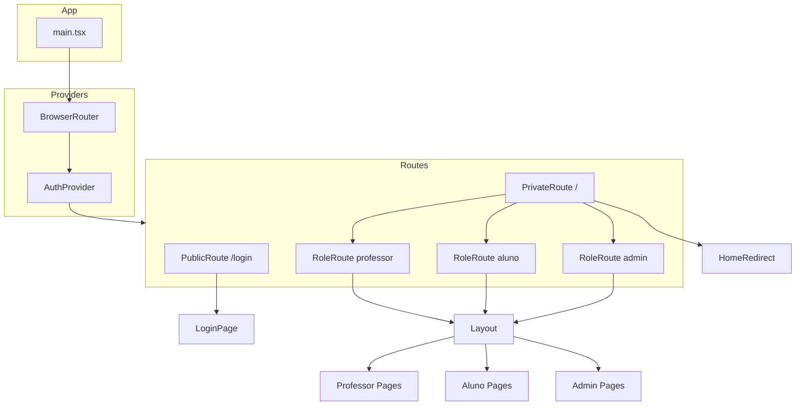
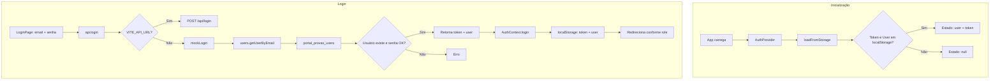
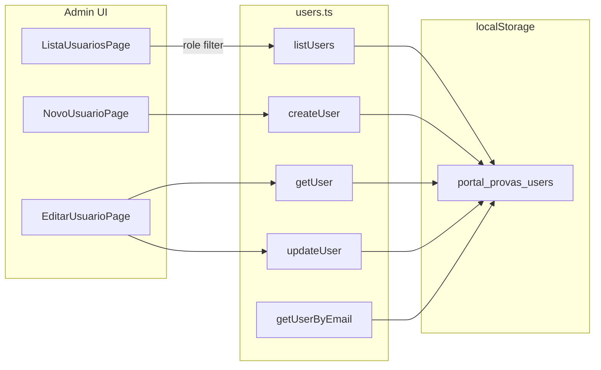
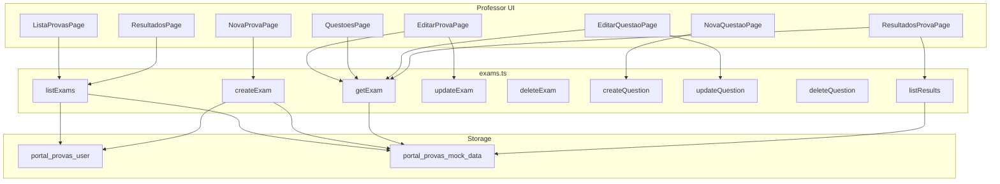
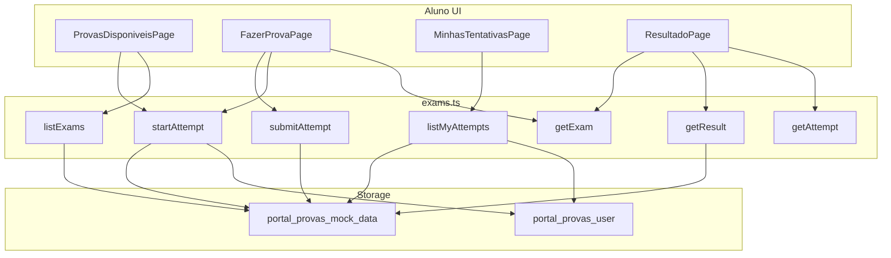
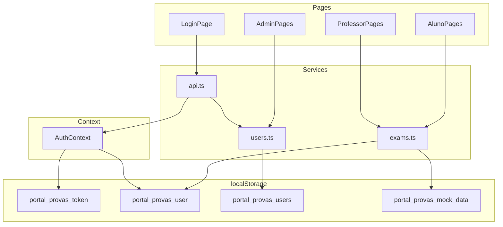
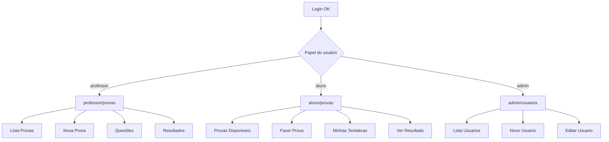

## 🎓 Portal de Provas Online — Frontend (React + TypeScript + Vite)

Este repositório contém o **frontend** do **Mini Sistema de Provas Online**, desenvolvido em **React 19**, **TypeScript 5** e **Vite 7**, com foco em **experiência do usuário**, **componentização** e **integração com APIs REST**.

O objetivo é simular a interface de um sistema educacional real, permitindo que **professores** e **alunos** interajam com provas online de forma simples e intuitiva.

---

## 🚀 Visão geral / Objetivo

Este projeto foi pensado para demonstrar:

- **Uso de React moderno** com TypeScript
- **Organização de pastas, componentes e páginas**
- **Integração com backend** via API REST
- **Boas práticas de UX** em sistemas educacionais

O frontend consome um backend responsável por:

- Autenticação (login)
- Aplicação de provas
- Cálculo e exibição de resultados

---

## 🧰 Stack Tecnológica

### Stack atual (implementada neste repositório)

- **React** `^19.2.0`
- **React DOM** `^19.2.0`
- **TypeScript** `~5.9.3`
- **Vite** `^7.3.1`
- **ESLint** (linting baseado em:
  - `@eslint/js`
  - `eslint-plugin-react-hooks`
  - `eslint-plugin-react-refresh`
  - `typescript-eslint`
  - `globals`)

### Ferramentas planejadas (a serem adicionadas)

- **React Router** — controle de rotas protegidas
- **Axios** — consumo de API REST com interceptadores
- **Tailwind CSS** — estilização utilitária e responsiva

> Algumas dessas ferramentas podem ainda não estar instaladas, mas fazem parte da visão de arquitetura do frontend.

---

## 🔧 Pré-requisitos

Para rodar o projeto localmente, você precisa de:

- **Node.js** (versão LTS recomendada)
- **Gerenciador de pacotes**:
  - Preferencialmente **pnpm** (existe `pnpm-lock.yaml` no projeto)
  - Alternativamente: `npm` ou `yarn`

---

## 📦 Instalação e uso

Dentro da pasta do projeto:

### 1. Instalar dependências

Com **pnpm** (recomendado):

```bash
pnpm install
```

Com **npm**:

```bash
npm install
```

### 2. Rodar em ambiente de desenvolvimento

```bash
pnpm dev
```

ou

```bash
npm run dev
```

Aplicação normalmente disponível em: `http://localhost:5173`

### 3. Build para produção

```bash
pnpm build
```

ou

```bash
npm run build
```

### 4. Preview do build

```bash
pnpm preview
```

ou

```bash
npm run preview
```

### 5. Lint

```bash
pnpm lint
```

ou

```bash
npm run lint
```

---

## 📜 Scripts disponíveis (`package.json`)

- **`pnpm dev` / `npm run dev`**: inicia o servidor de desenvolvimento Vite
- **`pnpm build` / `npm run build`**: compila o TypeScript (`tsc -b`) e gera o build de produção com Vite
- **`pnpm preview` / `npm run preview`**: roda um servidor para visualizar o build gerado
- **`pnpm lint` / `npm run lint`**: executa o ESLint em todo o projeto

---

## 🏗️ Estrutura do Projeto

Estrutura proposta para o frontend em React + TypeScript:

```text
/src
├── pages/           # Páginas principais (ex.: Login, Provas, Resultados)
├── components/      # Componentes reutilizáveis (botões, headers, cards, etc.)
├── services/
│   └── api.ts       # Configuração de cliente HTTP (ex.: Axios) e chamadas à API
├── routes/          # Definição de rotas (ex.: rotas públicas e protegidas)
├── hooks/           # Hooks personalizados (ex.: auth, fetch, etc.)
└── assets/          # Imagens, ícones, etc.

/public              # Arquivos estáticos públicos
```

> Mesmo que alguns desses arquivos ainda não existam, essa é a **arquitetura alvo** para organização do frontend.

---

## 📊 Fluxo de Dados

### Persistência (localStorage)

| Chave | Conteúdo | Usado por |
|-------|----------|-----------|
| `portal_provas_token` | Token JWT (mock) | AuthContext, exams (com API real) |
| `portal_provas_user` | `{ id, name, email, role }` | AuthContext, exams.ts |
| `portal_provas_users` | `{ users, nextId }` | users.ts (CRUD admin) |
| `portal_provas_mock_data` | `{ exams, questions, attempts, results }` | exams.ts |

### Fluxo geral da aplicação



### Fluxo de autenticação



### Fluxo Admin — CRUD de usuários



### Fluxo Professor — Provas e questões



### Fluxo Aluno — Provas e tentativas



### Integração entre serviços



### Fluxo por papel após login



---

## 🔐 Autenticação (visão funcional)

- Tela de login para:
  - Professor
  - Aluno
- Integração com backend que utiliza **JWT**
- Armazenamento seguro do token no frontend
- Rotas protegidas (planejadas) via **React Router**

---

## 🧑‍🏫 Funcionalidades — Professor

Algumas das funcionalidades planejadas/implementadas para o perfil **Professor**:

- Criar provas
- Criar questões de múltipla escolha
- Definir tempo de duração das provas
- Visualizar resultados das provas

> Alguns recursos podem estar em desenvolvimento ou em fase de refinamento.

---

## 🎓 Funcionalidades — Aluno

Para o perfil **Aluno**, o sistema prevê:

- Visualizar provas disponíveis
- Realizar prova com:
  - Cronômetro
  - Navegação entre questões
- Enviar respostas
- Visualizar nota final

---

## 🎨 Interface

- Layout responsivo
- Componentes reutilizáveis
- Feedback visual para:
  - Tempo restante
  - Questões respondidas
  - Finalização da prova

---

## 🌐 Integração com Backend

Integração planejada/esperada:

- Comunicação com API REST (ex.: via Axios)
- Utilização de **token JWT** para autenticação
- Interceptadores para requisições autenticadas
- Tratamento de erros e mensagens amigáveis ao usuário

---

## 🌍 Deploy

- Frontend preparado para deploy em plataformas como **Render**, Vercel, Netlify, etc.
- Processo típico:
  - Geração de build (`pnpm build` / `npm run build`)
  - Publicação da pasta de saída gerada pelo Vite

---

## 🔮 Melhorias Futuras / Roadmap

- Dashboard mais completo (gráficos, estatísticas por prova/questão)
- Melhorias de UX/UI
- Histórico de tentativas por aluno
- Acessibilidade (teclado, leitores de tela, contraste)
- Modo escuro
- Internacionalização (i18n)

---

## 🤝 Considerações Finais

Este frontend foi desenvolvido com foco em **clareza, usabilidade e organização do código**, voltado para avaliação técnica e portfólio.

Feedbacks, sugestões de melhorias e PRs são muito bem-vindos.

